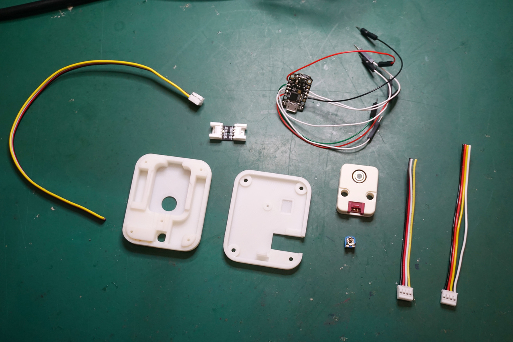
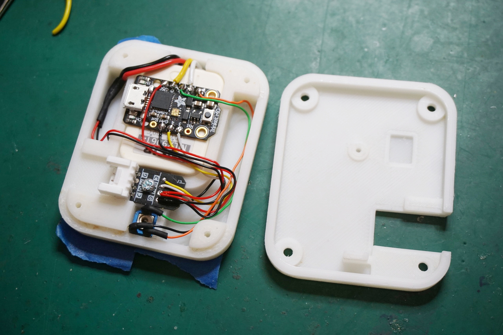
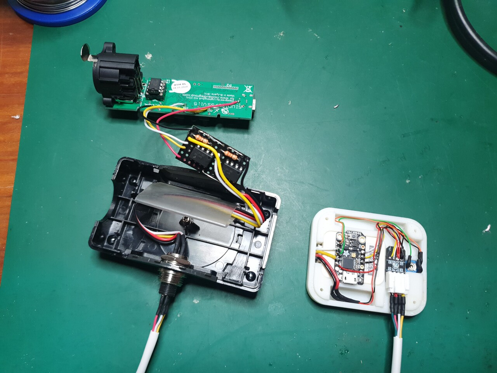
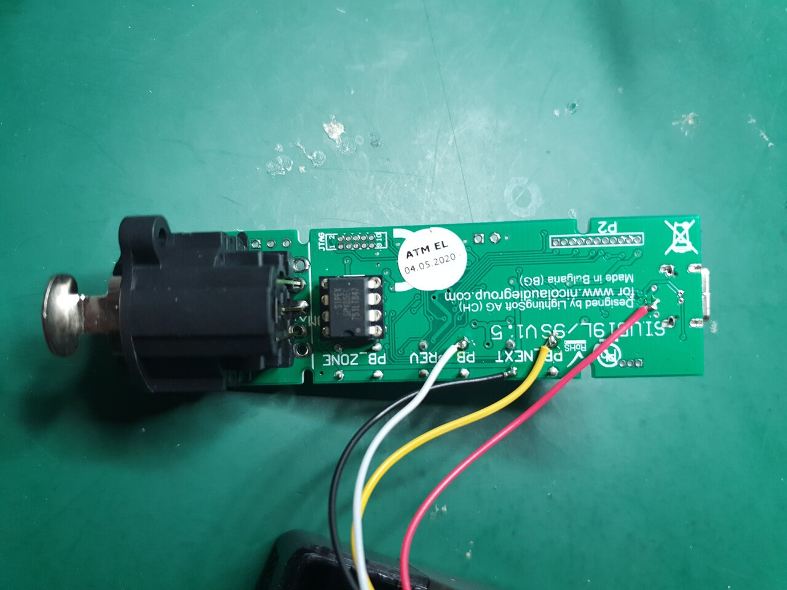
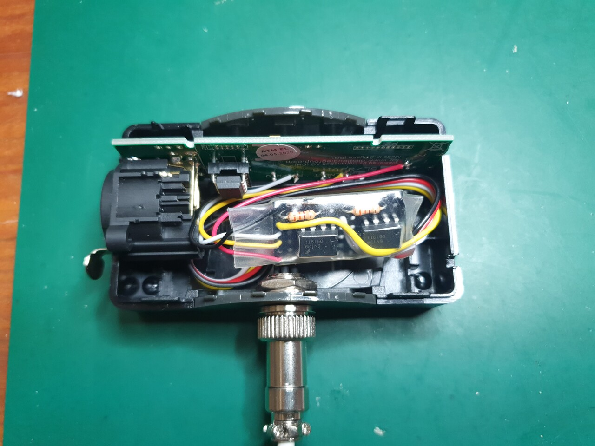

# Bluphoria Sensor

Hacking a Daslight [DVC FUN DMX interface](https://store.daslight.com/en/product/705-DVC-FUN) to allow zone selection based on temperature readings from an NCIR thermometer.

Two optocouples are used to simulate button presses of the `+` and `-` buttons on the interface.

Zones are selected based on temperature thresholds at regular intervals, which can be collectively raised or lowered using the trimpot to adjust to a given environment.

Sensor enclosure: https://cad.onshape.com/documents/3dc8ad7777348520b4033f4c/w/43689e7ea5b103356c1e0e5a/e/990b017af707860c51e203bc

## Components

- Adafruit Trinket M0
- M5 Stack NCIR module
- Trimpot
- 2x 6N139 Optocouples
- 2x 330R resistors
- Grove connector extension board and grove cable
- [mini XRL connector](https://mauser.pt/catalog/product_info.php?cPath=1874_640_851&products_id=011-1999)
- 2m 4-conductor cable

